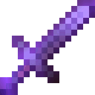
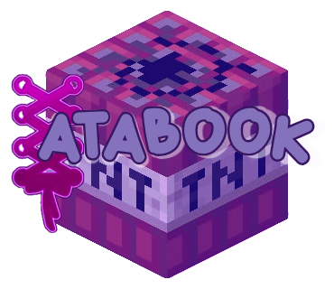
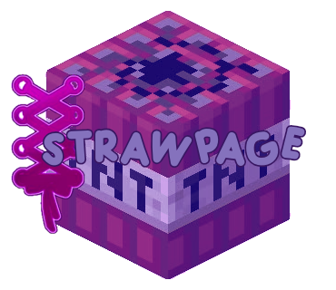

<p align="center">
</p>


<p align="right">
  $$
\color{#F58E27}{\text{  ╲ }}
$$
</p>


$$
\color{#D97816}{\text{Disc :  complex.yandere }}
$$

$$
\color{#858585}{\text{ Hello, basic information below }}
$$

$$
\color{#94352B}{\text{ minor . Male . Transgender x Orchidsexual }}
$$


  <table align="center">
<tr>

<td>
<a href="#sword">

</a>
</td>

</tr>
</table>
</td>

</tr>
</table>
</svg>


$$
\color{#94352B}{\text{Feel free to Tag me where ever }}
$$

$$
\color{#858585}{\text{ Do not copy skins, all skins will have THIS github }}
$$

$$
\color{#D97816}{\text{ oomf me up pls }}
$$

<table>
<tr>

<td width="140" align="center">


</td>

<td>

## EnchantDIHd Mace

> *"MACE ATTACK!!!."*

```text
══════════════════════════════
Rarity
✦✦✦✦✦ . LEGENDARY

Attack Damage
+11

Owner
The biggest bird (not YOU)

Enchantments
Wind Burst III
Unbreaking III

══════════════════════════════
```

</td>

<td width="60"></td>

<td align="center">

<a href="https://wemmb.atabook.org/">
    
</a>

<br><br>

<a href="(https://wemmbru.straw.page/)">
    
</a>

</td>

</tr>
</table>

<p align="right">
  $$
\color{#5e3a8c}{\text{✦ For ponytown usage only ✦ }}
$$
</p>
